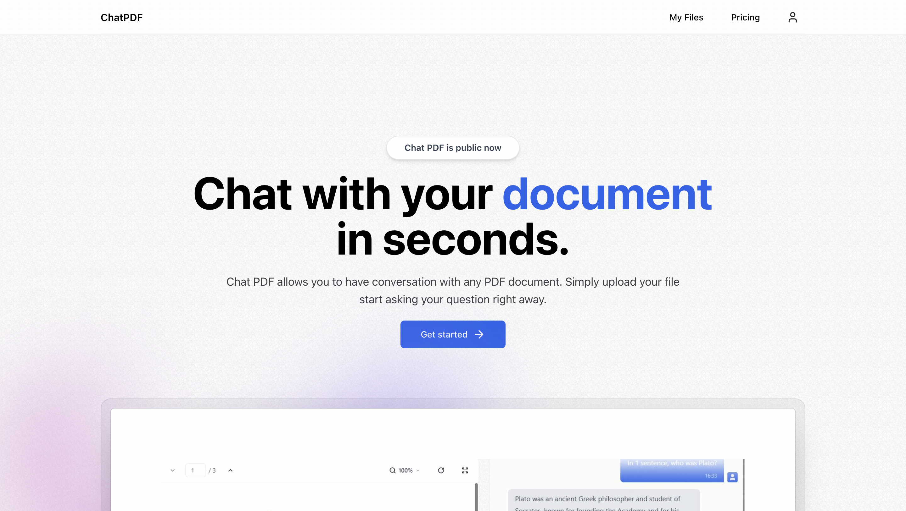
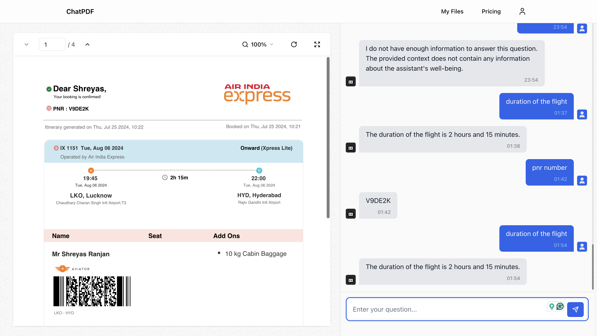

# ChatPDF SaaS Application

Check out the live application here:[Chat PDF](https://chat-pdf-mauve.vercel.app/)




**ChatPDF** is a SaaS application that allows users to upload PDFs and interact with them through a chat interface. This application uses AI to process the content of the PDFs and provide meaningful responses to user queries about the document.

## Features

- **Upload PDF:** Users can upload a PDF file to the platform.
- **Chat Interface:** Users can interact with the content of the uploaded PDF through a chat interface.
- **AI-Powered Responses:** The application uses AI to understand the content of the PDF and provide accurate responses.
- **Secure File Handling:** Uploaded PDFs are securely stored, and user interactions are private.

## Getting Started

### Prerequisites

- **Node.js** (v14.x or later)
- **Vercel Account:** For deployment.

### Installation

1. **Clone the repository:**

   ```bash
   git clone https://github.com/Shrey-R/ChatPDF.git
   cd ChatPDF


## SetUp
Env setup 

```bash
DATABASE_URL=""
DIRECT_URL=""
AUTH_SECRET=""
AUTH_GOOGLE_ID=""
AUTH_GOOGLE_SECRET=""
AUTH_GITHUB_ID=""
AUTH_GITHUB_SECRET=""
AUTH_RESEND_KEY=""
UPLOADTHING_SECRET=""
UPLOADTHING_APP_ID=""
PINECONE_API_KEY=""
GEMINI_API_KEY=""
NEXTAUTH_URL="http://localhost:3000"
RAZORPAY_KEY_ID=""
RAZORPAY_KEY_SECRET=""
NEXT_PUBLIC_RAZORPAY_KEY_ID=""
STRIPE_SECRET_KEY=""

```


First, run the development server:

```bash
npm install
npm run dev
# or
yarn dev
# or
pnpm dev
# or
bun dev
```

Open [http://localhost:3000](http://localhost:3000) with your browser to see the result.

You can start editing the page by modifying `app/page.tsx`. The page auto-updates as you edit the file.

## Technologies Used
- Next.js
- React
- tRPC
- Next-Auth
- Uploadthing S3 blucket wraper
- Gemini AI
- Superbase PostgreSQL
- Prisma ORM
- Pinecode vector Database
- Tailwind


## Deploy on Vercel

The easiest way to deploy your Next.js app is to use the [Vercel Platform](https://vercel.com/new?utm_medium=default-template&filter=next.js&utm_source=create-next-app&utm_campaign=create-next-app-readme) from the creators of Next.js.

Check out our [Next.js deployment documentation](https://nextjs.org/docs/deployment) for more details.
